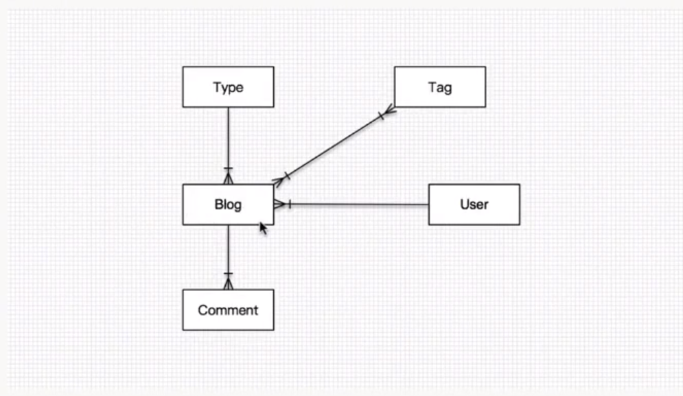
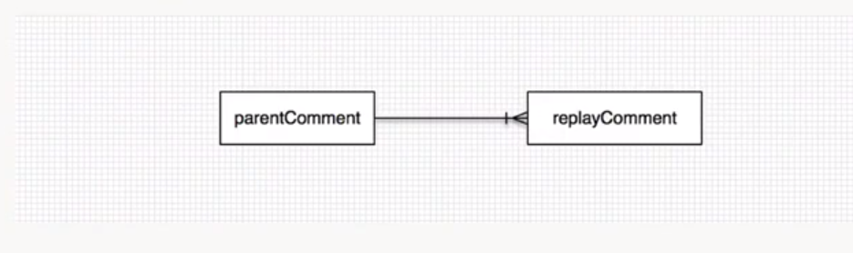

# 小而美的博客系统

## 开发环境
* Idea
* Maven
* Jdk8
* SpringBoot 2.2.1

## SpringBoot 模块
* Thymeleaf
* Jpa
* Lombok
* Aop
* MySQL
* DevTools

## 实体类设计
### 实体类
* 博客 Blog
* 博客分类 Type
* 博客标签 Tag
* 博客评论 Comment
* 用户 User
* 日志 Log

### 实体类关系

* 博客与分类：一对一（一篇博客只有一个分类）
* 博客与标签：一对多（一篇博客有多个标签）
* 博客与用户：多对一（一个用户有多篇博客）
* 博客与评论：一对多（一篇博客有多个评论）

